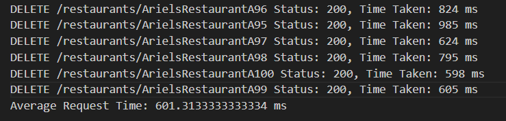
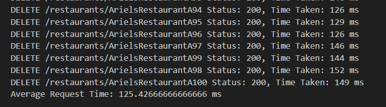

# Restaurants Load Testing Assignment

This project is designed to perform load testing on a restaurants application deployed on AWS. The application uses AWS services such as DynamoDB for data storage and optionally Memcached for caching. The goal is to ensure the application can handle a significant load and scale properly.

## Table of Contents

- [Architecture](#architecture)
- [Setup](#setup)
  - [Prerequisites](#prerequisites)
  - [Installation](#installation)
  - [Deployment](#deployment)
- [Configuration](#configuration)
- [Usage](#usage)
- [Load Testing](#load-testing)
- [Notes](#notes)

## Architecture

The application architecture includes the following components:

- **DynamoDB**: Used to store restaurant information.
- **EC2 Instances**: Hosts the application.
- **Elastic Load Balancer (ELB)**: Distributes incoming traffic across multiple EC2 instances.
- **Auto Scaling Group (ASG)**: Automatically adjusts the number of EC2 instances based on the load.
- **Optional Caching**: Memcached can be used to cache restaurant data.

## Setup

### Prerequisites

Ensure you have the following tools installed:

- [AWS CLI](https://aws.amazon.com/cli/)
- [Node.js](https://nodejs.org/en/download/)
- [CDK CLI](https://docs.aws.amazon.com/cdk/latest/guide/cli.html)

### Installation

Clone the repository:
```bash
git clone https://github.com/your-repo/restaurants-load-testing.git
cd restaurants-load-testing
```
Install dependencies:
```bash
npm install
```

### Deployment
1. Configure AWS CLI: Ensure your AWS CLI is configured with appropriate access rights.

2. Deploy the Stack: Use AWS CDK to deploy the infrastructure.
```bash
cdk deploy
```
This will set up the VPC, DynamoDB table, and EC2 instances required for the application.

### Configuration
- copy the credentials. and write ```bash
  nano ~/.aws/credentials
  ```
- Adjust all TODO statments
- Configuration settings are managed through environment variables. Ensure the following variables are set:
    #### MEMCACHED_CONFIGURATION_ENDPOINT:
    Endpoint for Memcached (if using caching).
    #### TABLE_NAME: 
    DynamoDB table name
    #### AWS_REGION:
    AWS region
    #### USE_CACHE:
    Set to false to disable caching

### Usage
#### Start the Application
copy the run command from the deploy massage

### Load Testing
#### Load Test Script
The LoadTest.js script is used to perform load testing. It can send a large number of requests to the application to test its performance under load.

#### My results 
- without cache:  

- with cache:  


#### Configuration
Modify the LoadTest.js script to configure the following parameters:

endPoint: The endpoint of your application. (load balancer)
requestCount: The number of requests to be sent.
concurrencyLevel: The number of concurrent requests.

#### Running the Load Test
Run the load test script with the following command:
```bash
  node LoadTest.js
  ```
### Notes
Testing Configuration: Ensure that the configuration and endpoints match your AWS setup.
Scaling: Adjust the scaling settings in the Auto Scaling Group as needed for your testing purposes.
This README provides an overview of setting up, configuring, and performing load testing on the restaurants application. For more detailed information, refer to the AWS and Node.js documentation.


